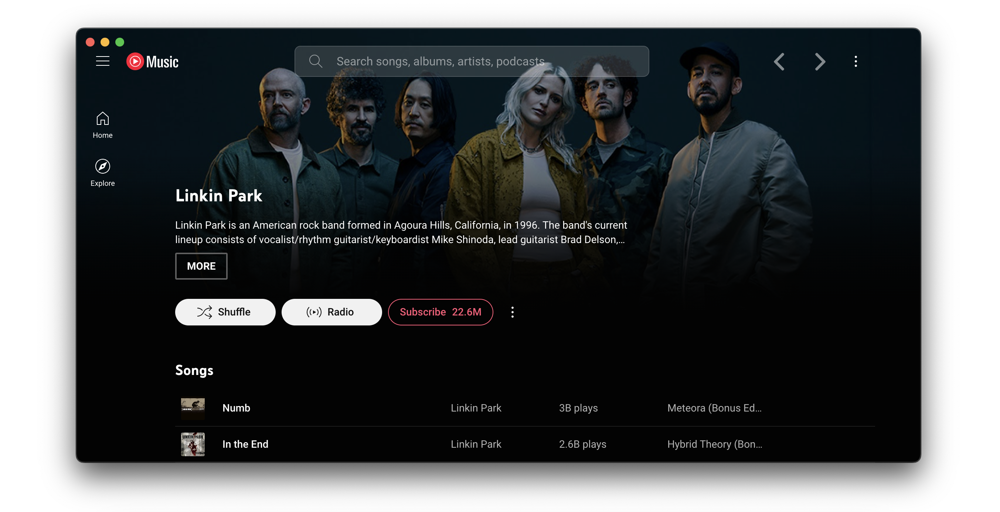

<div align="center">

# YouTube Music

[](https://github.com/th-ch/youtube-music/releases/)
[](https://github.com/th-ch/youtube-music/blob/master/LICENSE)
[](https://github.com/th-ch/youtube-music/blob/master/eslint.config.mjs)
[](https://GitHub.com/th-ch/youtube-music/releases/)
[](https://GitHub.com/th-ch/youtube-music/releases/)
[](https://aur.archlinux.org/packages/youtube-music-bin)
[](https://snyk.io/test/github/th-ch/youtube-music)

</div>




<div align="center">
	<a href="https://github.com/th-ch/youtube-music/releases/latest">
		
	</a>
</div>

Read this in other languages: [🇰🇷](./docs/readme/README-ko.md), [🇮🇸](./docs/readme/README-is.md), [🇨🇱 🇪🇸](./docs/readme/README-es.md), [🇷🇺](./docs/readme/README-ru.md)

**Electron wrapper around YouTube Music featuring:**

- Native look & feel, aims at keeping the original interface
- Framework for custom plugins: change YouTube Music to your needs (style, content, features), enable/disable plugins in
  one click

## Demo Image

|                          Player Screen (album color theme & ambient light)                                |
|:---------------------------------------------------------------------------------------------------------:|
||

## Content

- [Features](#features)
- [Available plugins](#available-plugins)
- [Translation](#translation)
- [Download](#download)
  - [Arch Linux](#arch-linux)
  - [MacOS](#macos)
  - [Windows](#windows)
    - [How to install without a network connection? (in Windows)](#how-to-install-without-a-network-connection-in-windows)
- [Themes](#themes)
- [Dev](#dev)
- [Build your own plugins](#build-your-own-plugins)
  - [Creating a plugin](#creating-a-plugin)
  - [Common use cases](#common-use-cases)
- [Build](#build)
- [Production Preview](#production-preview)
- [Tests](#tests)
- [License](#license)
- [FAQ](#faq)

## Features:

- **Auto confirm when paused** (Always Enabled): disable
  the ["Continue Watching?"](https://user-images.githubusercontent.com/61631665/129977894-01c60740-7ec6-4bf0-9a2c-25da24491b0e.png)
  popup that pause music after a certain time

 - And more ...

## Available plugins:

- **Ad Blocker**: Block all ads and tracking out of the box

- **Album Actions**: Adds Undislike, Dislike, Like, and Unlike buttons to apply this to all songs in a playlist or album

- **Album Color Theme**: Applies a dynamic theme and visual effects based on the album color palette

- **Ambient Mode**: Applies a lighting effect by casting gentle colors from the video, into your screen’s background

- **Audio Compressor**: Apply compression to audio (lowers the volume of the loudest parts of the signal and raises the
  volume of the softest parts)

- **Blur Navigation Bar**: makes navigation bar transparent and blurry

- **Bypass Age Restrictions**: bypass YouTube's age verification

- **Captions Selector**: Enable captions

- **Compact Sidebar**: Always set the sidebar in compact mode

- **Crossfade**: Crossfade between songs

- **Disable Autoplay**: Makes every song start in "paused" mode

- **[Discord](https://discord.com/) Rich Presence**: Show your friends what you listen to
  with [Rich Presence](https://user-images.githubusercontent.com/28219076/104362104-a7a0b980-5513-11eb-9744-bb89eabe0016.png)

- **Downloader**: downloads
  MP3 [directly from the interface](https://user-images.githubusercontent.com/61631665/129977677-83a7d067-c192-45e1-98ae-b5a4927393be.png) [(youtube-dl)](https://github.com/ytdl-org/youtube-dl)

- **Exponential Volume**: Makes the volume
  slider [exponential](https://greasyfork.org/en/scripts/397686-youtube-music-fix-volume-ratio/) so it's easier to
  select lower volumes

- **In-App Menu**: [gives bars a fancy, dark look](https://user-images.githubusercontent.com/78568641/112215894-923dbf00-8c29-11eb-95c3-3ce15db27eca.png)

  > (see [this post](https://github.com/th-ch/youtube-music/issues/410#issuecomment-952060709) if you have problem
  accessing the menu after enabling this plugin and hide-menu option)

- **Scrobbler**: Adds scrobbling support for [Last.fm](https://www.last.fm/) and [ListenBrainz](https://listenbrainz.org/)

- **Lumia Stream**: Adds [Lumia Stream](https://lumiastream.com/) support

- **Lyrics Genius**: Adds lyrics support for most songs

- **Music Together**: Share a playlist with others. When the host plays a song, everyone else will hear the same song

- **Navigation**: Next/Back navigation arrows directly integrated in the interface, like in your favorite browser

- **No Google Login**: Remove Google login buttons and links from the interface

- **Notifications**: Display a notification when a song starts
  playing ([interactive notifications](https://user-images.githubusercontent.com/78568641/114102651-63ce0e00-98d0-11eb-9dfe-c5a02bb54f9c.png)
  are available on windows)

- **Picture-in-picture**: allows to switch the app to picture-in-picture mode

- **Playback Speed**: Listen fast, listen
  slow! [Adds a slider that controls song speed](https://user-images.githubusercontent.com/61631665/129976003-e55db5ba-bf42-448c-a059-26a009775e68.png)

- **Precise Volume**: Control the volume precisely using mousewheel/hotkeys, with a custom hud and customizable volume
  steps

- **Shortcuts (& MPRIS)**: Allows setting global hotkeys for playback (play/pause/next/previous) +
  disable [media osd](https://user-images.githubusercontent.com/84923831/128601225-afa38c1f-dea8-4209-9f72-0f84c1dd8b54.png)
  by overriding media keys + enable Ctrl/CMD + F to search + enable linux mpris support for
  mediakeys + [custom hotkeys](https://github.com/Araxeus/youtube-music/blob/1e591d6a3df98449bcda6e63baab249b28026148/providers/song-controls.js#L13-L50)
  for [advanced users](https://github.com/th-ch/youtube-music/issues/106#issuecomment-952156902)

- **Skip Disliked Song**: Skips disliked songs

- **Skip Silences**: Automatically skip silenced sections

- [**SponsorBlock**](https://github.com/ajayyy/SponsorBlock): Automatically Skips non-music parts like intro/outro or
  parts of music videos where the song isn't playing

- **Synced Lyrics**: Provides synced lyrics to songs, using providers like [LRClib](https://lrclib.net).

- **Taskbar Media Control**: Control playback from
  your [Windows taskbar](https://user-images.githubusercontent.com/78568641/111916130-24a35e80-8a82-11eb-80c8-5021c1aa27f4.png)

- **TouchBar**: Custom TouchBar layout for macOS

- **Tuna OBS**: Integration with [OBS](https://obsproject.com/)'s
  plugin [Tuna](https://obsproject.com/forum/resources/tuna.843/)

- **Video Quality Changer**: Allows changing the video quality with
  a [button](https://user-images.githubusercontent.com/78568641/138574366-70324a5e-2d64-4f6a-acdd-dc2a2b9cecc5.png) on
  the video overlay

- **Video Toggle**: Adds
  a [button](https://user-images.githubusercontent.com/28893833/173663950-63e6610e-a532-49b7-9afa-54cb57ddfc15.png) to
  switch between Video/Song mode. can also optionally remove the whole video tab

- **Visualizer**: Different music visualizers


## Translation

You can help with translation on [Hosted Weblate](https://hosted.weblate.org/projects/youtube-music/).

<a href="https://hosted.weblate.org/engage/youtube-music/">
  
  
</a>

## Download

You can check out the [latest release](https://github.com/th-ch/youtube-music/releases/latest) to quickly find the
latest version.

### Arch Linux

Install the [`youtube-music-bin`](https://aur.archlinux.org/packages/youtube-music-bin) package from the AUR. For AUR installation instructions, take a look at
this [wiki page](https://wiki.archlinux.org/index.php/Arch_User_Repository#Installing_packages).

### macOS

You can install the app using Homebrew (see the [cask definition](https://github.com/th-ch/homebrew-youtube-music)):

```bash
brew install th-ch/youtube-music/youtube-music
```

If you install the app manually and get an error "is damaged and can’t be opened." when launching the app, run the following in the Terminal:

```bash
/usr/bin/xattr -cr /Applications/YouTube\ Music.app
```

### Windows

You can use the [Scoop package manager](https://scoop.sh) to install the `youtube-music` package from
the [`extras` bucket](https://github.com/ScoopInstaller/Extras).

```bash
scoop bucket add extras
scoop install extras/youtube-music
```

Alternately you can use [Winget](https://learn.microsoft.com/en-us/windows/package-manager/winget/), Windows 11s
official CLI package manager to install the `th-ch.YouTubeMusic` package.

*Note: Microsoft Defender SmartScreen might block the installation since it is from an "unknown publisher". This is also
true for the manual installation when trying to run the executable(.exe) after a manual download here on github (same
file).*

```bash
winget install th-ch.YouTubeMusic
```

#### How to install without a network connection? (in Windows)

- Download the `*.nsis.7z` file for _your device architecture_ in [release page](https://github.com/th-ch/youtube-music/releases/latest).
  - `x64` for 64-bit Windows
  - `ia32` for 32-bit Windows
  - `arm64` for ARM64 Windows
- Download installer in release page. (`*-Setup.exe`)
- Place them in the **same directory**.
- Run the installer.

## Themes

You can load CSS files to change the look of the application (Options > Visual Tweaks > Themes).

Some predefined themes are available in https://github.com/kerichdev/themes-for-ytmdesktop-player.

## Dev

```bash
git clone https://github.com/th-ch/youtube-music
cd youtube-music
pnpm install --frozen-lockfile
pnpm dev
```

## Build your own plugins

Using plugins, you can:

- manipulate the app - the `BrowserWindow` from electron is passed to the plugin handler
- change the front by manipulating the HTML/CSS

### Creating a plugin

Create a folder in `src/plugins/YOUR-PLUGIN-NAME`:

- `index.ts`: the main file of the plugin
```typescript
import style from './style.css?inline'; // import style as inline

import { createPlugin } from '@/utils';

export default createPlugin({
  name: 'Plugin Label',
  restartNeeded: true, // if value is true, ytmusic show restart dialog
  config: {
    enabled: false,
  }, // your custom config
  stylesheets: [style], // your custom style,
  menu: async ({ getConfig, setConfig }) => {
    // All *Config methods are wrapped Promise<T>
    const config = await getConfig();
    return [
      {
        label: 'menu',
        submenu: [1, 2, 3].map((value) => ({
          label: `value ${value}`,
          type: 'radio',
          checked: config.value === value,
          click() {
            setConfig({ value });
          },
        })),
      },
    ];
  },
  backend: {
    start({ window, ipc }) {
      window.maximize();

      // you can communicate with renderer plugin
      ipc.handle('some-event', () => {
        return 'hello';
      });
    },
    // it fired when config changed
    onConfigChange(newConfig) { /* ... */ },
    // it fired when plugin disabled
    stop(context) { /* ... */ },
  },
  renderer: {
    async start(context) {
      console.log(await context.ipc.invoke('some-event'));
    },
    // Only renderer available hook
    onPlayerApiReady(api: YoutubePlayer, context: RendererContext) {
      // set plugin config easily
      context.setConfig({ myConfig: api.getVolume() });
    },
    onConfigChange(newConfig) { /* ... */ },
    stop(_context) { /* ... */ },
  },
  preload: {
    async start({ getConfig }) {
      const config = await getConfig();
    },
    onConfigChange(newConfig) {},
    stop(_context) {},
  },
});
```

### Common use cases

- injecting custom CSS: create a `style.css` file in the same folder then:

```typescript
// index.ts
import style from './style.css?inline'; // import style as inline

import { createPlugin } from '@/utils';

export default createPlugin({
  name: 'Plugin Label',
  restartNeeded: true, // if value is true, ytmusic will show a restart dialog
  config: {
    enabled: false,
  }, // your custom config
  stylesheets: [style], // your custom style
  renderer() {} // define renderer hook
});
```

- If you want to change the HTML:

```typescript
import { createPlugin } from '@/utils';

export default createPlugin({
  name: 'Plugin Label',
  restartNeeded: true, // if value is true, ytmusic will show the restart dialog
  config: {
    enabled: false,
  }, // your custom config
  renderer() {
    // Remove the login button
    document.querySelector(".sign-in-link.ytmusic-nav-bar").remove();
  } // define renderer hook
});
```

- communicating between the front and back: can be done using the ipcMain module from electron. See `index.ts` file and
  example in `sponsorblock` plugin.

## Build

1. Clone the repo
2. Follow [this guide](https://pnpm.io/installation) to install `pnpm`
3. Run `pnpm install --frozen-lockfile` to install dependencies
4. Run `pnpm build:OS`

- `pnpm dist:win` - Windows
- `pnpm dist:linux` - Linux (amd64)
- `pnpm dist:linux:deb-arm64` - Linux (arm64 for Debian)
- `pnpm dist:linux:rpm-arm64` - Linux (arm64 for Fedora)
- `pnpm dist:mac` - macOS (amd64)
- `pnpm dist:mac:arm64` - macOS (arm64)

Builds the app for macOS, Linux, and Windows,
using [electron-builder](https://github.com/electron-userland/electron-builder).

## Production Preview

```bash
pnpm start
```

## Tests

```bash
pnpm test
```

Uses [Playwright](https://playwright.dev/) to test the app.

## License

MIT © [th-ch](https://github.com/th-ch/youtube-music)

## FAQ

### Why apps menu isn't showing up?

If `Hide Menu` option is on - you can show the menu with the <kbd>alt</kbd> key (or <kbd>\`</kbd> [backtick] if using
the in-app-menu plugin)
