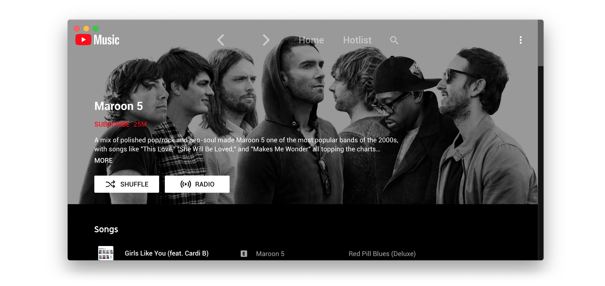

# YouTube Music

<div align="center">

[](https://github.com/th-ch/youtube-music/releases/)
[](https://github.com/th-ch/youtube-music/blob/master/LICENSE)
[](https://github.com/sindresorhus/xo)
[](https://GitHub.com/th-ch/youtube-music/releases/)
[](https://snyk.io/test/github/th-ch/youtube-music)
[](https://GitHub.com/th-ch/youtube-music/releases/)
[](https://aur.archlinux.org/packages/youtube-music-bin)

</div>



<div align="center">
	<a href="https://github.com/th-ch/youtube-music/releases/latest">
		
	</a>
</div>

**Electron wrapper around YouTube Music featuring:**

- Native look & feel, aims at keeping the original interface
- Framework for custom plugins: change YouTube Music to your needs (style, content, features), enable/disable plugins in one click

## Download

You can check out the [latest release](https://github.com/th-ch/youtube-music/releases/latest) to quickly find the latest version.

### Arch Linux

Install the `youtube-music-bin` package from the AUR. For AUR installation instructions, take a look at this [wiki page](https://wiki.archlinux.org/index.php/Arch_User_Repository#Installing_packages).

### MacOS

If you get an error "is damaged and can’t be opened." when launching the app, run the following in the Terminal:
```
xattr -cr /Applications/YouTube\ Music.app
```

### Windows

You can use the [Scoop package manager](https://scoop.sh) to install the `youtube-music` package from the [`extras` bucket](https://github.com/ScoopInstaller/Extras).

```
scoop bucket add extras
scoop install extras/youtube-music
```

Alternately you can use [Winget](https://learn.microsoft.com/en-us/windows/package-manager/winget/), Windows 11s official CLI package manager to install the `th-ch.YouTubeMusic` package.

*Note: Microsoft Defender SmartScreen might block the installation since it is from an "unknown publisher". This is also true for the manual installation when trying to run the executable(.exe) after a manual download here on github (same file).*

```
winget install th-ch.YouTubeMusic
```

## Available plugins:

- **Ad Blocker**: Block all ads and tracking out of the box

- **Audio Compressor**: Apply compression to audio (lowers the volume of the loudest parts of the signal and raises the volume of the softest parts)

- **Blur Nav Bar**: makes navigation bar transparent and blurry

- **Bypass age restrictions**: bypass YouTube's age verification

- **Captions selector**: Enable captions

- **Crossfade**: Crossfade between songs

- **Disable Autoplay**: Makes every song start in "paused" mode

- [**Discord**](https://discord.com/): Show your friends what you listen to with [Rich Presence](https://user-images.githubusercontent.com/28219076/104362104-a7a0b980-5513-11eb-9744-bb89eabe0016.png)

- **Downloader**: downloads MP3 [directly from the interface](https://user-images.githubusercontent.com/61631665/129977677-83a7d067-c192-45e1-98ae-b5a4927393be.png) [(youtube-dl)](https://github.com/ytdl-org/youtube-dl)

- **Exponential Volume**: Makes the volume slider [exponential](https://greasyfork.org/en/scripts/397686-youtube-music-fix-volume-ratio/) so it's easier to select lower volumes.

- **In-App Menu**: [gives bars a fancy, dark look](https://user-images.githubusercontent.com/78568641/112215894-923dbf00-8c29-11eb-95c3-3ce15db27eca.png)

  > (see [this post](https://github.com/th-ch/youtube-music/issues/410#issuecomment-952060709) if you have problem accessing the menu after enabling this plugin and hide-menu option)

- [**Last.fm**](https://www.last.fm/): Scrobbles support

- **Lyrics Genius**: Adds lyrics support for most songs

- **Navigation**: Next/Back navigation arrows directly integrated in the interface, like in your favorite browser

- **No Google Login**: Remove Google login buttons and links from the interface

- **Notifications**: Display a notification when a song starts playing ([interactive notifications](https://user-images.githubusercontent.com/78568641/114102651-63ce0e00-98d0-11eb-9dfe-c5a02bb54f9c.png) are available on windows)

- **Picture in picture**: allows to switch the app to picture-in-picture mode

- **Playback Speed**: Listen fast, listen slow! [Adds a slider that controls song speed](https://user-images.githubusercontent.com/61631665/129976003-e55db5ba-bf42-448c-a059-26a009775e68.png)

- **Precise Volume**: Control the volume precisely using mousewheel/hotkeys, with a custom hud and customizable volume steps

- **Quality Changer**: Allows changing the video quality with a [button](https://user-images.githubusercontent.com/78568641/138574366-70324a5e-2d64-4f6a-acdd-dc2a2b9cecc5.png) on the video overlay

- **Shortcuts**: Allows setting global hotkeys for playback (play/pause/next/previous) + disable [media osd](https://user-images.githubusercontent.com/84923831/128601225-afa38c1f-dea8-4209-9f72-0f84c1dd8b54.png) by overriding media keys + enable Ctrl/CMD + F to search + enable linux mpris support for mediakeys + [custom hotkeys](https://github.com/Araxeus/youtube-music/blob/1e591d6a3df98449bcda6e63baab249b28026148/providers/song-controls.js#L13-L50) for [advanced users](https://github.com/th-ch/youtube-music/issues/106#issuecomment-952156902)

- **Skip-Silences** - Automatically skip silenced sections

- [**SponsorBlock**](https://github.com/ajayyy/SponsorBlock): Automatically Skips non-music parts like intro/outro or parts of music videos where the song isn't playing

- **Taskbar Media Control**: Control playback from your [Windows taskbar](https://user-images.githubusercontent.com/78568641/111916130-24a35e80-8a82-11eb-80c8-5021c1aa27f4.png)

- **Touchbar**: Custom TouchBar layout for macOS

- **Tuna-OBS**: Integration with [OBS](https://obsproject.com/)'s plugin [Tuna](https://obsproject.com/forum/resources/tuna.843/)

- **Video Toggle**: Adds a [button](https://user-images.githubusercontent.com/28893833/173663950-63e6610e-a532-49b7-9afa-54cb57ddfc15.png) to switch between Video/Song mode. can also optionally remove the whole video tab

- **Visualizer**: Different music visualizers

---

- **Auto confirm when paused** (Always Enabled): disable the ["Continue Watching?"](https://user-images.githubusercontent.com/61631665/129977894-01c60740-7ec6-4bf0-9a2c-25da24491b0e.png) popup that pause music after a certain time

> If `Hide Menu` option is on - you can show the menu with the <kbd>alt</kbd> key (or <kbd>\`</kbd> [backtick] if using the in-app-menu plugin)

## Themes

You can load CSS files to change the look of the application (Options > Visual Tweaks > Themes).

Some predefined themes are available in https://github.com/kerichdev/themes-for-ytmdesktop-player.

## Dev

```sh
git clone https://github.com/th-ch/youtube-music
cd youtube-music
yarn
yarn start
```

## Build your own plugins

Using plugins, you can:

- manipulate the app - the `BrowserWindow` from electron is passed to the plugin handler
- change the front by manipulating the HTML/CSS

### Creating a plugin

Create a folder in `plugins/YOUR-PLUGIN-NAME`:

- if you need to manipulate the BrowserWindow, create a file `back.js` with the following template:

```node
module.exports = win => {
	// win is the BrowserWindow object
};
```

- if you need to change the front, create a file `front.js` with the following template:

```node
module.exports = () => {
	// This function will be called as a preload script
	// So you can use front features like `document.querySelector`
};
```

### Common use cases

- injecting custom CSS: create a `style.css` file in the same folder then:

```node
const path = require("path");
const { injectCSS } = require("../utils");

// back.js
module.exports = win => {
	injectCSS(win.webContents, path.join(__dirname, "style.css"));
};
```

- changing the HTML:

```node
// front.js
module.exports = () => {
	// Remove the login button
	document.querySelector(".sign-in-link.ytmusic-nav-bar").remove();
};
```

- communicating between the front and back: can be done using the ipcMain module from electron. See `utils.js` file and example in `navigation` plugin.

## Build

1. Clone the repo
2. Run `yarn` to install dependencies
3. Run `yarn build:OS`
   - `yarn build:win` - Windows
   - `yarn build:linux` - Linux
   - `yarn build:mac` - MacOS

Builds the app for macOS, Linux, and Windows, using [electron-builder](https://github.com/electron-userland/electron-builder).

## Tests

```sh
yarn test
```

Uses [Playwright](https://playwright.dev/) to test the app.

## License

MIT © [th-ch](https://github.com/th-ch/youtube-music)
